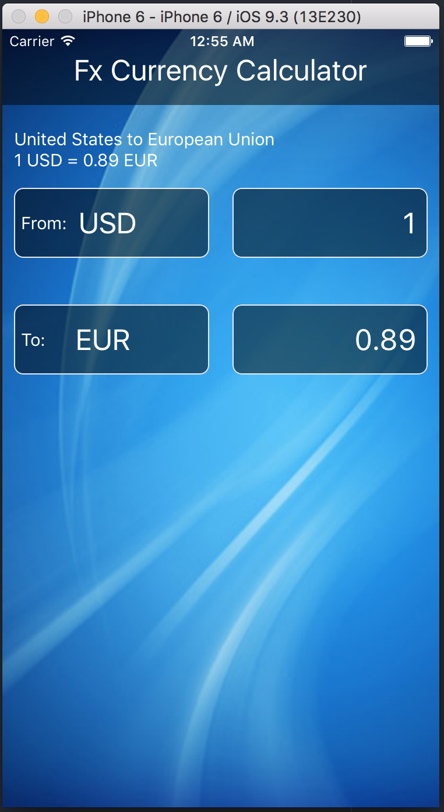
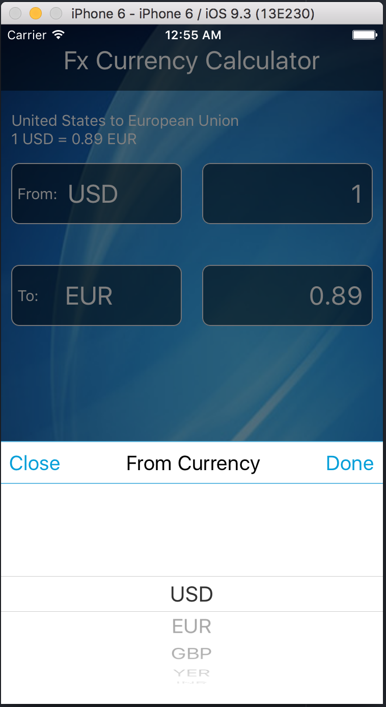
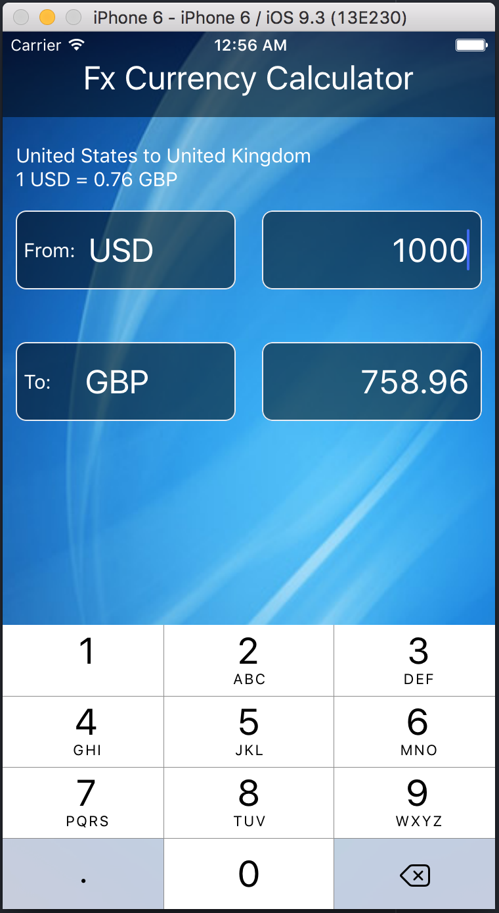

# FxCurrency
Global Forex Currency Converter

Currency Calculator application developed in React Native to support cross-platform iPhone and Android versions.

This has reusable component <b>CurrencyPickerView</b>, can be used as picker modal component.

####Test Cases
Test cases for Forex Exchange Currency Converter has been added in JSFiddle.
- <b>React native Redux - Forex Currency Calculator TestCases</b>
https://jsfiddle.net/jagadishuppala/qpukzsbt/

####Service Integration and Stub Data
Service used for integration: https://www.mycurrency.net/service/rates

Data can be stubbed to test locally. To test locally use <b>stubData: true'</b>,

To use the service provided by mycurrency.net change <b>stubData: false </b> in ConverterView.js.

####Screenshots

